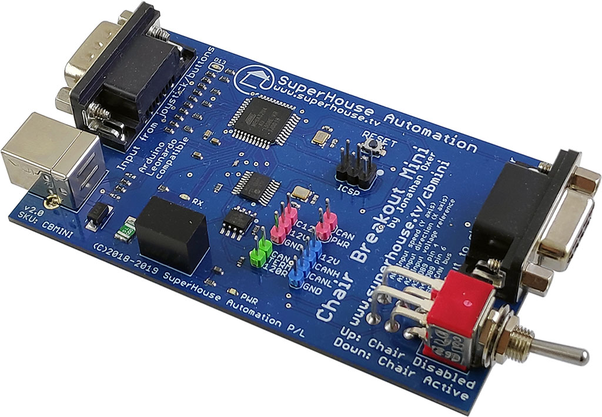

Chair Control Breakout Mini
===========================

Connects between an electric wheelchair input device and the chair
controller, so that the input device can be read by an Arduino and
redirected to another system.

The output can be isolated so that the chair won't receive the input
signals, preventing it from moving while the input is being used for
another purpose such as controlling a computer or remote control
device.

The breakout can send the output to either a connected USB host such
as a computer, or other devices via CAN bus so the wheelchair controls
can be used to fly a drone or drive a remote control car.

Features:

 * 1 x input device connection.
 * 1 x input device pass-through output
 * CAN bus
 * Can derives 12V power from the host wheelchair controller or separately

More information is available at:

  http://www.superhouse.tv/cbmini

Hardware
--------
The "Hardware" directory contains the PCB design as an EAGLE project.
EAGLE PCB design software is available from Autodesk free for
non-commercial use.

Firmware
--------
The "Firmware" directory contains example firmware as an Arduino
project.

Credits
-------
Jonathan Oxer jon@oxer.com.au

License
-------
Copyright 2017-2020 SuperHouse Automation Pty Ltd  www.superhouse.tv  

The hardware portion of this project is licensed under the TAPR Open
Hardware License (www.tapr.org/OHL). The "license" folder within this
repository contains a copy of this license in plain text format.

The software portion of this project is licensed under the Simplified
BSD License. The "licence" folder within this project contains a
copy of this license in plain text format.

